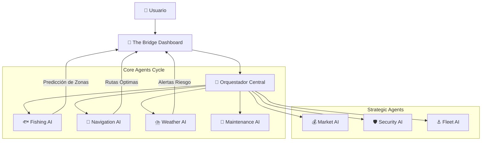

<div align="center">


[](https://opensource.org/licenses/MIT)
[](https://www.typescriptlang.org/)
[](https://reactjs.org/)
[](https://pocketbase.io/)
[](https://www.docker.com/)
[](https://vitejs.dev/)
[](https://tailwindcss.com/)

[**Explorar Docs**](./docs) · [**Ver Demo**](https://sardin-ai.demo) · [**Reportar Bug**](../../issues/new) · [**Solicitar Feature**](../../issues/new)

</div>

---

## 🌊 Visión General

**SARDIN-AI** es una plataforma de inteligencia marítima de próxima generación, diseñada para empoderar a cooperativas pesqueras con tecnología de punta. Combina **Inteligencia Artificial**, **Análisis de Datos en Tiempo Real** y **IoT** para optimizar la pesca sostenible.

> **Estado Actual:** 🟢 **V 1.0.0 - STABLE (PocketBase Migration Complete)**

### 🤖 Sistema Multi-Agente Autónomo

El corazón de SARDIN-AI late gracias a 7 agentes especializados:



---

## 🚀 Características Principales

| Módulo | Descripción | Estado |
|:---|:---|:---:|
| **🗺️ Maritime Map** | Visualización geoespacial con capas de datos oceanográficos (Temp, Clorofila). | ✅ |
| **🎣 Fishing Insights** | Predicción de zonas de pesca basadas en ML y datos históricos. | ✅ |
| **📊 Analytics Dashboard** | Métricas en tiempo real de consumo, capturas y rendimiento. | ✅ |
| **🔐 Auth & Security** | Sistema robusto de roles y permisos gestionado por PocketBase. | ✅ |
| **📱 PWA Ready** | Funciona offline y se instala en dispositivos móviles. | ✅ |
| **🎮 Gamification** | (WIP) Sistema de logros y niveles para incentivar buenas prácticas. | 🚧 |

---

## 🛠️ Stack Tecnológico

SARDIN-AI está construido sobre hombros de gigantes, utilizando un stack moderno, performante y totalmente Open Source.

- **Frontend:** React 18, TypeScript, Vite, TailwindCSS, Framer Motion.
- **Backend:** PocketBase (SQLite + Realtime + Auth).
- **Mapas:** Leaflet, React-Leaflet, OpenSeaMap.
- **Data Science:** TensorFlow.js (Futuro), Simple-Statistics.
- **DevOps:** Docker, Github Actions, Dokploy.

---

## ⚡ Inicio Rápido

### Prerrequisitos

- Node.js 18+
- Docker (Opcional, recomendado para backend)

### 1. Clonar el repositorio

```bash
git clone https://github.com/zyztek/sardin-sea-mind.git
cd sardin-sea-mind
```

### 2. Instalar dependencias

```bash
npm install
```

### 3. Iniciar Backend (PocketBase)

Si tienes Docker:

```bash
docker-compose up -d pocketbase
```

*O descarga el ejecutable en `./pocketbase` y ejecuta `./pocketbase serve`*

### 4. Iniciar Frontend

```bash
npm run dev
```

Visita `http://localhost:5173` y sumérgete en el océano de datos.

---

## 📂 Estructura del Proyecto

```bash
sardin-sea-mind/
├── 📂 .github/         # CI/CD y Templates de Comunidad
├── 📂 .devcontainer/   # Configuración de Codespaces
├── 📂 docs/            # Documentación Técnica y Brainstorms
├── 📂 pocketbase/      # Configuración del Backend y Schema
├── 📂 src/
│   ├── 📂 agents/      # Lógica del Sistema Multi-Agente
│   ├── 📂 components/  # Biblioteca de Componentes UI
│   ├── 📂 hooks/       # Lógica React Reutilizable
│   ├── 📂 services/    # Integración con APIs Externas
│   └── 📂 pages/       # Vistas de la Aplicación
└── 📄 docker-compose.yml
```

---

## 🤝 Contribución

¡Queremos tu ayuda para limpiar los océanos y optimizar la pesca!
Por favor lee nuestro [CONTRIBUTING.md](./CONTRIBUTING.md) para detalles de nuestro código de conducta y el proceso para enviar Pull Requests.

1. Haz un **Fork** del proyecto.
2. Crea tu rama de feature (`git checkout -b feature/AmazingFeature`).
3. Haz **Commit** de tus cambios (`git commit -m 'Add some AmazingFeature'`).
4. Haz **Push** a la rama (`git push origin feature/AmazingFeature`).
5. Abre un **Pull Request**.

---

## 📜 Licencia

Distribuido bajo la licencia MIT. Ver `LICENSE` para más información.

---

<div align="center">

**Hecho con ❤️ y 🐟 por el equipo SARDIN-AI**

[Reportar Bug](../../issues) • [Solicitar Feature](../../issues) • [Roadmap](./docs/ROADMAP.md)

</div>
