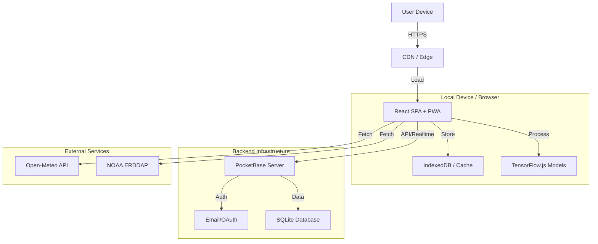

# 🏗️ SARDIN-AI Architecture Overview

## High-Level System Design

SARDIN-AI follows a **Modern Headless Monolith** approach, optimized for simplicity in deployment but scalable in logic via its Multi-Agent System.

## Core Components

### 1. The Frontend (The Bridge)

- **Technology**: React 18, Vite, TypeScript.
- **State Management**: React Context + Custom Hooks.
- **Styling**: TailwindCSS with a custom "Oceanic" design system.
- **Responsiveness**: Mobile-first design ensures captains can use it on tablets.

### 2. The Backend (The Engine Room)

- **Technology**: PocketBase (Go).
- **Function**:
  - Handles User Authentication & Roles.
  - CRUD operations for Catch Reports, Vessels, and Routes.
  - Real-time subscriptions for Chat and Alerts.
- **Database**: Embedded SQLite (Wal mode).

### 3. The AI Agents (The Crew)

Instead of a heavy backend AI server, SARDIN-AI runs lightweight agents **in the browser** (Edge AI) or via server-side hooks.

- **FishingAI**: Analyzes historical catch data + current weather.
- **NavigationAI**: Calculates fuel costs and ETA.
- **WeatherAI**: Continuous polling of APIs for storm alerts.

## Data Flow

1. **Ingestion**: Agents pull data from Open-Meteo and NOAA.
2. **Processing**: Data is normalized and passed to prediction models.
3. **Visualization**: The Dashboard renders layers on the map.
4. **Action**: User makes a decision (e.g., "Set Route").
5. **Persistence**: Action is saved to PocketBase.

---
*See [[API Reference]] for endpoint details.*
